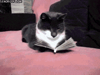

# Books

## Goal

My New Year's Resolution for 2019 is to read one book a week \(aka. 52 books in total\). I use Goodreads to track all of the books that I read. Check out my profile and follow my progress [here](https://www.goodreads.com/user/show/70543748-paulina-khew).

## All Time Favourite Books

* **The Book Thief** - Markus Zusak
* **The Boy in the Striped Pyjamas** - John Boyne

## Books to Read

* [ ] **Do Androids Dream of Electric Sheep?** - Philip K. Dick
* [ ] **The Hitchhiker's Guide to the Galaxy**  - Douglas Adams
* [ ] **New and Selected Poems Volume One** - Mary Oliver
* [ ] **10% Happier** - Dan Harris
* [ ] **Sapiens** - Yuvan Noah Harari
* [ ] **Flow** - Mihaly Csikszentmihalyi
* [ ] **Man's Search for Meaning** - Viktor E. Frankl
* [ ] **The Snowball: Warren Buffett and the Business of Life** - Alice Schroeder
* [ ] **Steve Jobs** - Walter Isaacson
* [ ] I **Know Why the Caged Bird Sings** - Maya Angelou
* [ ] **When Things Fall Apart** - Pema Chodron
* [ ] **Atomic Habits** - James Clear
* [ ] **Way of the Wolf** - Jordan Belfort
* [ ] **Outliers: The Story of Success** - Malcolm Gladwell
* [ ] **Talk like TED** - Carmine Gallo
* [ ] **Year of Yes** - Shonda Rhimes
* [ ] **Complete Book of Women's Running** - Dagny Barrios
* [ ] **12 Rules for Life: An Antidote to Chaos** - Jordan Peterson
* [ ] **Bridge of Clay** - Markus Zusak
* [ ] **Think and Grow Rich** - Napolean Hill
* [ ] A **Fine Balance** - Rohitan Mistry
* [ ] **Thinking, Fast and Slow** - Daniel Kahneman
* [ ] **Atlas Shrugged** - Ayn Rand
* [ ] **Norwegian Wood** - Haruki Murakami
* [ ] **Kafka on the Shore** - Haruki Murakami
* [ ] **The Bullet Journal Method** - Ryder Carroll
* [ ] **High Performance Habits** - Brendon Burchard
* [ ] **1984** - George Orwell
* [ ] **Fahrenheit 451** - Ray Bradbury
* [ ] **The Testaments** - Margaret Atwood
* [ ] **Enlightenment Now** - Steven Pinker

## Books Read in 2019

| Title | Author | Date Completed |
| :--- | :--- | :--- |
| Have a Little Faith | Mitch Albom | January 1 |
| The Next Person You Meet in Heaven | Mitch Albom | January 1 |
| The Kite Runner | Khaled Hosseini | January 10 |
| I am the Messenger | Markus Zusak | January 14 |
| The Diary of a Young Girl | Anne Frank | January 23 |
| The Handmaid's Tale | Margaret Atwood | January 27 |
| The Subtle Art of Not Giving a F\*ck | Mark Manson | February 5 |
| Astrophysics for People in a Hurry | Neil deGrasse Tyson | February 28 |
| The Thing Around Your Neck | Chimamanda Ngozi Adichie | March 19 |
| After Dark | Haruki Murakami | March 20 |
| After the Quake | Haruki Murakami | March 21 |
| Blind Willow, Sleeping Woman | Haruki Murakami | April 14 |
| Le Petit Prince | Antoine de Saint-Exupéry | April 24 |
| Brave New World | Aldous Huxley | May 7 |
| Othello | William Shakespeare | May 22 |
| The Time Traveler's Wife | Audrey Niffenegger | May 30 |
| The Power of Habit | Charles Duhigg | June 26 |
| Kafka on the Shore | Haruki Murakami | July 5 |
| The Magician's Nephew | C. S. Lewis | August 14 |
| The Lion, the Witch and the Wardrobe | C. S. Lewis | August 15 |
| The Horse and his Boy | C. S. Lewis | August 15 |
| Prince Caspian | C. S. Lewis | August 16 |
| The Voyage of the Dawn Treader | C. S. Lewis | August 18 |
| The Silver Chair | C. S. Lewis | August 21 |
| The Last Battle | C. S. Lewis | August 21 | 
| The Elephant Vanishes | Haruki Murakami | September 10 | 
| The Adventures of Sherlock Holmes | Sir Arthur Conan Doyle | September 25 |
| Shoe Dog | Phil Knight | November 13 | 
| The Siren | Kiera Cass | November 30 |

