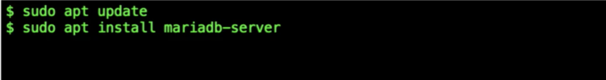
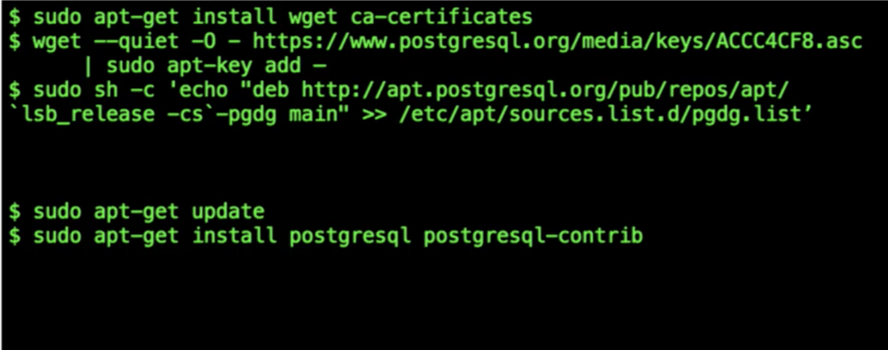
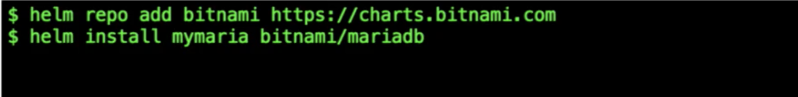

# An Introduction to Helm



## What is Helm

### Where Helm Came From - Deis Workflow is in the Past

* helm was the product of a company called Deis
  * had a platform-as-a-service called **Workflow** where you deploy a 12-factor application that you could run on top of Kubernetes
* Deis needed a way to store stuff \(such as mysql, postgres\) and install that into your Kubernetes cluster
  * this is why Helm was created

### Helm - the Package Manager for Kubernetes

#### What is a package manager?

* tooling that enables someone who has knowledge of an application and a platform to package up an application so that someone else who has neither extensive knowledge of the application or the way it needs to be run on the platform can use it

#### An apt example

* this is a simple apt update
  * apt update knowledge about packages, install it, and it works

* Ubuntu doesn't know about postgres
* you have to add knowledge, add certificates, get knowledge about the package from postgres, update, add repository, then install

#### With Helm

* add bitnami chart repo and then install mariadb from bitnami chart repo

### Is Helm Trustworthy?

* "Helm can be recommended for public deployment" - First Helm Security Audit Report

* helm started in October 2015
* has passed a million downloads per month
* uses semantic versioning
  * v{{major}}.{{minor}}.{{patch}}
* has a 1-year support window
* offers release candidates
  * more release candidates come out than releases
* releases are signed
* supports Mac, Linux, and Windows

## How to Use Helm

### Helm Charts

* helm packages are referred to as **charts** - deployable units for Kubernetes-bound applications

