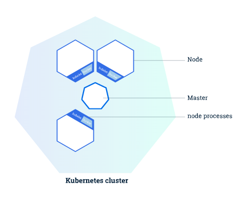

# Learn Kubernetes Basics

## What can Kubernetes do?

* you can enable applications to be released and updated quickly through containerization
  * meet users' needs by deploying updates to your web services several times a day
* Kubernetes helps you make sure containerized applications run when and where you want and helps them find the resources and tools they need to work
* **Kubernetes:** a production-ready, open source platform
  * designed with Google's experience in container orchestration + ideas from the community

## Create a Cluster

### Using Minikube to Create a Cluster

* **Kubernetes cluster:** a highly available cluster of computers that are connected to work as a single unit
* you can deploy an application to a cluster without tying them to a specific machine
* **containerizing** applications makes sure that they are packaged in a way that decouples them from individual hosts
  * containerized apps are more flexible and available than apps that are installed directly onto specific machines
* **Kubernetes automates the distribution and scheduling of application containers across a cluster in a more efficient way**
* a Kubernetes cluster consists of two types of resources:
  * the **Master** coordinates the cluster
  * **Nodes** are the workers that run applications

* **The master manages the cluster by coordinating all activities**
  * schedules applications
  * maintaining applications' desired state
  * scales applications
  * rolls out new updates
* **A node is a virtual machine \(VM\) or a physical computer that serves as a worker machine in a Kubernetes cluster**
  * each node has a **Kubelet,** an agent for managing the node and communicating with the Kubernetes master
  * the node should have tools for handling container operations
    * e.g. Docker or rkt
  * a Kubernetes cluster that handles production traffic should have a minimum of three nodes

> Masters manage the cluster and the nodes that are used to host the running applications.

* when deploying apps to Kubernetes, you tell the master to start the application containers
* the master schedules the containers to run on the cluster's nodes
* **the nodes communicate with the master using the** [**Kubernetes API**](https://kubernetes.io/docs/concepts/overview/kubernetes-api/)**,** which the master exposes
* end users can use the Kubernetes API directly to interact with the cluster

* a Kubernetes cluster can be deployed on either physical or virtual machines
* you can use **Minikube** to start with Kubernetes development

  * **Minikube:** a lightweight Kubernetes implementation that creates a VM on your local machine and deploys a simple cluster containing a single node
    * available for Linux, macOS, Windows
  * provides basic bootstrapping operations for working with your cluster
    * e.g. start, stop, status, delete

